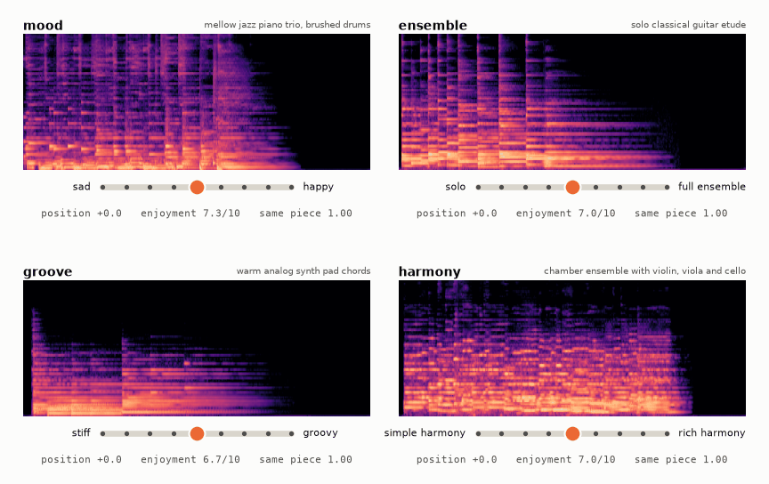
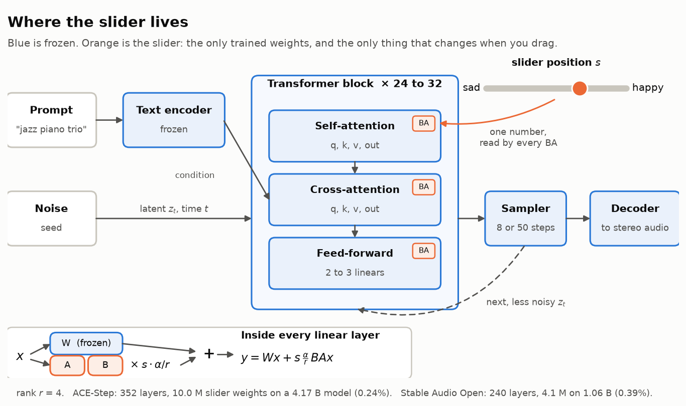
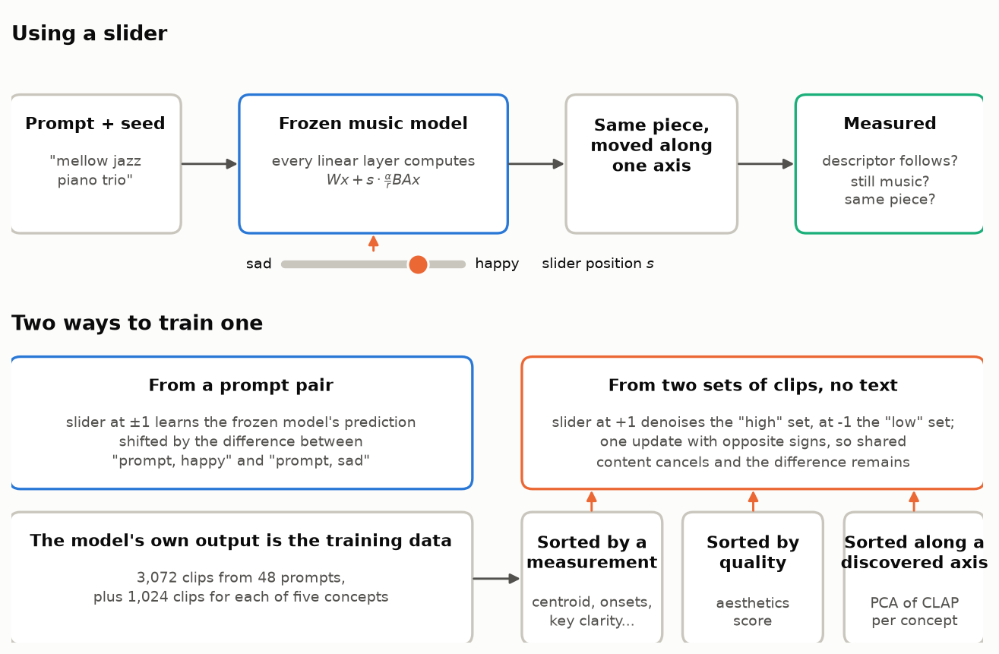
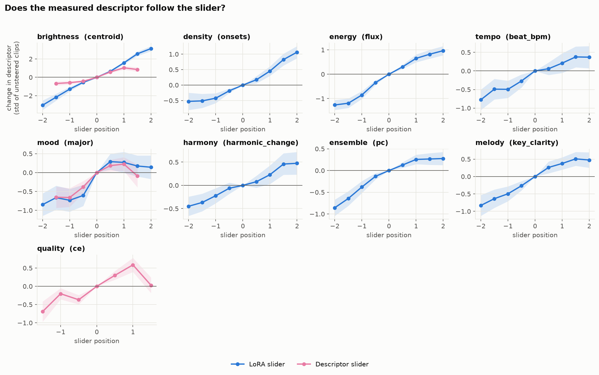
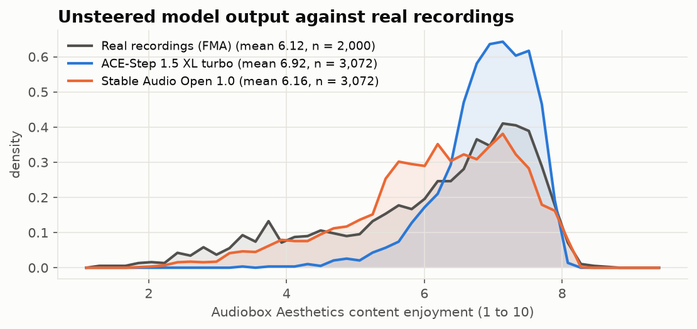
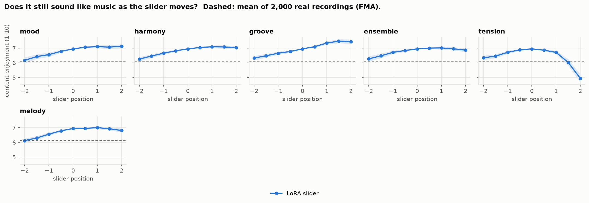
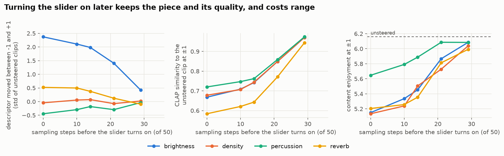
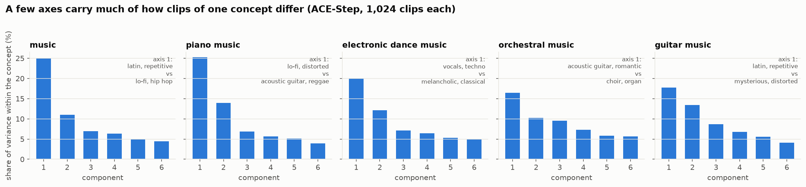
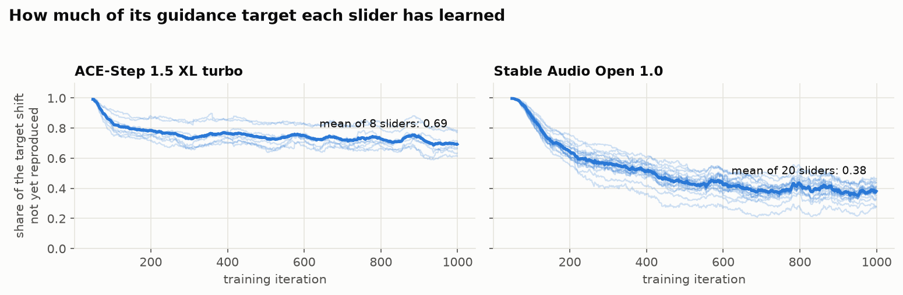

# Audio Sliders

[](https://github.com/takakhoo/audio-diffusion-control/actions/workflows/tests.yml)

**Sliders for generated music that are measured, and that keep it sounding like music.** A slider is a small LoRA on a frozen text-to-music model. Drag it and the same piece, same prompt and same seed, moves along one axis: sad to happy, solo to full ensemble, stiff to groovy, plain harmony to rich harmony, dark to bright. The model is untouched and the slider adds no extra sampling passes.



*Four real sliders on four held-out prompts. Each panel is one prompt and one seed; only the slider moves. The knob sweeps from the middle to +2, back to -2, and home, while the spectrogram redraws and the readout shows the Audiobox enjoyment score and how close the clip stays to the unsteered one.*

**[Listen and drag the sliders yourself: live demo](https://takakhoo.github.io/audio-diffusion-control/)** (8 sliders, 5 prompts, 360 clips, with the measured numbers at every position)

> **Status (2 Oct 2026): evaluation still running.** Everything below is measured and reproducible from this repository. Tables will grow as the remaining runs finish.

## Headline

Six musical sliders on ACE-Step 1.5 XL turbo, each trained from one prompt pair in about 20 minutes. 24 held-out prompts, 3 seeds, 9 slider positions, 648 clips per slider.

| Slider | What rises toward + (CLAP tags) | What falls | Measured descriptor follows? (ρ, ends ordered) | Usable span | Piece kept | Enjoyment at the ends |
|---|---|---|---|---|---:|---:|
| [**mood**](https://takakhoo.github.io/audio-diffusion-control/?model=ace&method=lora&slider=mood&prompt=0&x=2) (sad to happy) | happy, latin, reggae | distorted, dark-toned, lo-fi | major/minor fit: 0.39, 75% | -1 to +2 | 0.79 | 6.65 |
| [**ensemble**](https://takakhoo.github.io/audio-diffusion-control/?model=ace&method=lora&slider=ensemble&prompt=0&x=2) (solo to full) | orchestral film score, epic, choir | straight, funk, hip hop | production complexity: 0.60, 90% | -1.5 to +2 | 0.80 | 6.56 |
| [**groove**](https://takakhoo.github.io/audio-diffusion-control/?model=ace&method=lora&slider=groove&prompt=0&x=2) (stiff to groovy) | latin, funk, reggae | choir, strings, cello | no descriptor assigned | -1.5 to +2 | 0.79 | 6.88 |
| [**harmony**](https://takakhoo.github.io/audio-diffusion-control/?model=ace&method=lora&slider=harmony&prompt=0&x=2) (plain to rich) | minor key, melancholic, major key | country, vocals, violin | harmonic change rate: 0.41, 76% | -1.5 to +2 | 0.83 | 6.64 |
| [**melody**](https://takakhoo.github.io/audio-diffusion-control/?model=ace&method=lora&slider=melody&prompt=0&x=2) (texture to tune) | romantic, happy, blues | lo-fi, mysterious, calm | key clarity: 0.48, 78% | -1 to +2 | 0.80 | 6.47 |
| [**tension**](https://takakhoo.github.io/audio-diffusion-control/?model=ace&method=lora&slider=tension&prompt=0&x=1) (relaxed to tense) | metal, rock, distorted | melancholic, uplifting, sad | no descriptor assigned | -1.5 to +1 | 0.83 | 5.64 |

Each slider name opens the live demo on that slider. For scale: unsteered clips score 6.95 on Audiobox Aesthetics content enjoyment, and 2,000 real recordings from FMA average 6.1. "Usable span" is how far the slider goes before mean enjoyment falls more than 0.5 below the unsteered clips. "Piece kept" is CLAP similarity to the unsteered clip at the ends of that span. Full tables: [`results/ace/`](results/ace/).

## Contents

- [How it works](#how-it-works)
- [The science, step by step](#the-science-step-by-step)
- [Try it](#try-it)
- [What happened to v0](#what-happened-to-v0)
- [Layout](#layout)

## How it works



1. **One mechanism.** Every linear layer in the transformer's attention and feed-forward blocks gets a rank-4 update whose strength is a number read at each forward pass. Zero is the original model; negative values work as well as positive ones; several sliders add ([`lora.py`](audiosliders/lora.py)).
2. **Trained from a prompt pair.** The slider at ±1 learns to reproduce the frozen model's prediction shifted by the difference between its predictions for "prompt, happy" and "prompt, sad". This is the Concept Sliders objective, here for a v-prediction diffusion model and a rectified-flow model ([`train.py`](audiosliders/train.py)).
3. **Or trained from two sets of clips, with no text.** Generate a corpus with the model, measure something on every clip, and train the slider with the plain denoising loss at +1 on the top 30% and at -1 on the bottom 30%. One update serves both ends with opposite sign, so what the sets share cancels. The measurement can be a signal descriptor, a quality score, or the projection on a discovered direction ([`contrast.py`](audiosliders/contrast.py)).


4. **Two backbones, one interface.** ACE-Step 1.5 XL turbo (48 kHz, 8 steps, 0.4 s per 10 s clip) and Stable Audio Open 1.0 (44.1 kHz, 50 steps, 0.65 s per clip) ([`ace.py`](audiosliders/ace.py), [`backbone.py`](audiosliders/backbone.py)).

## The science, step by step

### 1. A slider has to pass three tests

Published audio sliders are scored by text-audio similarity in a learned embedding. That says the output drifted toward a word. It does not say the audio changed in the intended way, that it is still the same piece, or that it is still music. So every slider here is tested on:

- **A measured property of the waveform**, chosen before training: spectral centroid, onset rate, harmonic change rate, key clarity, major/minor fit, pulse clarity, level dynamics, and more ([`descriptors.py`](audiosliders/descriptors.py)). No learned model is involved.
- **Whether it still sounds like music**: Audiobox Aesthetics on every clip, anchored by 2,000 real recordings ([`quality.py`](audiosliders/quality.py)).
- **Whether it is still the same piece**: CLAP, chroma, and onset-envelope similarity to the same seed at position zero.

A fourth readout says what changed in words: 80 instrument, genre, mood, and character tags scored in CLAP space ([`tags.py`](audiosliders/tags.py)).

### 2. The measured descriptor follows the slider



Each curve is the mean change from the unsteered clip over 72 trajectories, in units of the descriptor's spread across unsteered clips. Harmony moves the harmonic change rate by about half a standard deviation in each direction, and ensemble, melody, and mood all rise with their slider.

### 3. Pushing too far stops sounding like music, and that is measurable



First the yardstick. Audiobox Aesthetics scores 2,000 real recordings from FMA at 6.12 on average. Unsteered ACE-Step output scores 6.92 with a much tighter spread, and unsteered Stable Audio Open output scores 6.16, about the same as the real recordings. Then the same score at every slider position:



The dashed line is the mean of real recordings. Five of the six sliders stay above it across the whole range. Tension collapses past +1, which is why its usable span ends there. The negative ends (sadder, sparser, plainer) cost a little enjoyment; the positive ends cost almost none.

### 4. Leaving the first steps alone keeps the piece

On Stable Audio Open the slider can be switched on only after the earliest, noisiest sampling steps, the ones that decide the layout of the piece. For the brightness slider at positions ±1 on 24 held-out prompts:

| Slider switched on after | Centroid moved (std) | CLAP similarity to original | Chroma similarity | Enjoyment (6.16 unsteered) |
|---|---:|---:|---:|---:|
| step 0 of 50 | 2.37 | 0.67 | 0.68 | 5.15 |
| step 14 | 1.98 | 0.74 | 0.74 | 5.45 |
| **step 21** | **1.41** | **0.85** | **0.84** | **5.87** |
| step 29 | 0.42 | 0.97 | 0.97 | 6.08 |



Starting at step 21 keeps most of the effect and cuts the loss in enjoyment from 1.0 to 0.3 points. All four tested sliders show the same pattern ([`results/gating/`](results/gating/)).

### 5. The embedding can say yes while the waveform says no

On Stable Audio Open, the text sliders for "density" and "percussion" move the output along their CLAP text direction, as the published evaluations would report. The measured onset rate and percussive energy share do not follow: rank correlation at or below 0.37 and a range near zero at every gate setting. A slider that only passes the embedding test has not been shown to do its job, and this is the reason sliders can also be trained from the measurement itself.

### 6. A slider trained with no text

Sorting the model's own clips by measured spectral centroid and training between the two ends gives a brightness slider that moves the mean centroid from 408 Hz at -2 to 1,488 Hz at +1 (899 Hz unsteered) on 8 held-out prompts in a pilot run, with stereo width, loudness, and low-end energy nearly unchanged. The text slider for brightness drags all three along. The same trainer, sorting by aesthetics score, gives a quality slider. Full evaluation of these is in the running queue.

### 7. Axes nobody named

For each of five broad concepts, 1,024 clips were generated on ACE-Step and their CLAP embeddings decomposed with PCA. The leading components carry 16 to 25% of the variance within a concept, and the tags they point toward and away from read as musical contrasts:



| Concept | Component | Toward | Away |
|---|---|---|---|
| guitar music | 1 (17.8%) | latin, repetitive, happy, funk | mysterious, distorted, tense, improvised |
| guitar music | 4 (6.8%) | brass, blues, playful, romantic | dreamy, harp, ambient, mysterious |
| piano music | 1 (25.3%) | lo-fi, distorted, hip hop, electric piano | acoustic guitar, reggae, happy, repetitive |
| piano music | 2 (14.0%) | blues, loud, playful, organ | dreamy, ambient, reverberant, harp |
| electronic dance music | 3 (7.1%) | calm, minor key, lo-fi, piano | aggressive, trumpet, loud, latin |
| orchestral music | 4 (7.3%) | piano, lo-fi, dreamy, cello | organ, choir, bells, loud |

All 30 are in [`results/discovery/ace/pca.md`](results/discovery/ace/pca.md) with their correlations to every descriptor. Training these directions into sliders with the set trainer is in the running queue.

### 8. How well a slider learns its target



The prompt-pair trainer asks the slider to reproduce a shift in the frozen model's prediction. After 1,000 iterations the Stable Audio sliders reproduce about 62% of that shift on average and the ACE-Step sliders about 31%. The ACE-Step sliders work anyway, as section 2 shows, but they are the ones with the most room left: longer training and higher rank are the obvious next experiments.

## Try it

```bash
pip install -e ".[dev]"
python -m pytest -q          # 44 CPU tests, no model download
```

With a GPU:

```bash
pip install -e ".[model,experiments,demo]" audiobox_aesthetics
python -m audiosliders.train mood --backbone ace-turbo --eta 2 --out runs/sliders/ace   # about 20 minutes
python experiments/sweep.py runs/sliders/ace/mood.safetensors --backbone ace-turbo      # descriptor table per position
python -m audiosliders.server --sliders runs/sliders/ace --backbone ace-turbo           # live page: type a prompt, drag sliders
```

The server page adds a live panel under the recorded demo: type any prompt, set any combination of sliders, and it returns the clip in two to four seconds with its enjoyment score and descriptors. On a remote GPU box, forward the port (`ssh -L 7860:127.0.0.1:7860 host`) and open `localhost:7860`.

ACE-Step 1.5 is MIT-licensed and ungated. Stable Audio Open 1.0 needs a Hugging Face account that has accepted its license.

## What happened to v0

The first version of this repository never ran a model. Its sampling script wrote white noise, its embedding script wrote hash-seeded random vectors, and its training script wrote a JSON plan. It is preserved unchanged in [`legacy/`](legacy/) with a note on what each piece did.

## Layout

- [`audiosliders/`](audiosliders/): backbones, slider LoRA, both trainers, measurement code, demo server
- [`configs/`](configs/): 20 slider definitions, the 48/24 train/eval prompt split, discovery concepts
- [`experiments/`](experiments/): scripts and job lists behind each number
- [`results/`](results/): tables and figures
- [`paper/`](paper/): draft write-up
- [`docs/`](docs/): demo page and the [research map](docs/RESEARCH.md) of prior work
- [`tests/`](tests/): CPU tests

## Credits

By Taka Khoo. Built on ACE-Step 1.5 and Stable Audio Open 1.0. The prompt-pair objective is from Concept Sliders and the discovery idea from SliderSpace (Gandikota et al.). Audiobox Aesthetics is from Meta, CLAP from LAION, and the real-music reference is the FMA dataset.
