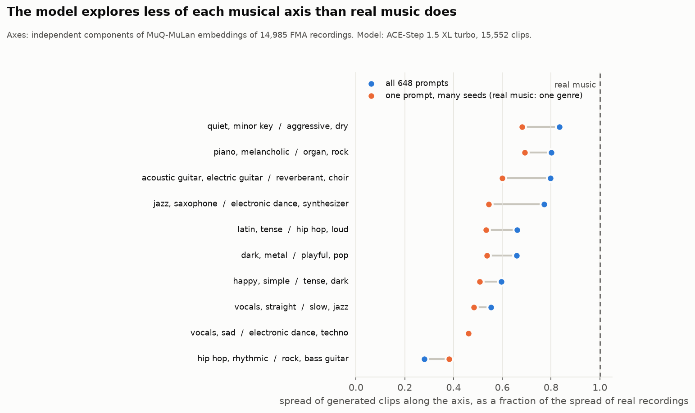

# How much of real music's axes does a model cover?

The axes come from 14,985 FMA recordings ([`../discovery/real`](../discovery/real/README.md)). Here each generated corpus is projected on them. Three numbers per axis:

- **all prompts**: spread (standard deviation) of every generated clip along the axis, divided by the spread of the real recordings.
- **one prompt**: the same after removing each prompt's mean from the generated clips and each genre's mean from the recordings. This is what changing only the seed can reach.
- **offset**: where the average generated clip sits, in standard deviations of real music. Positive means toward the first set of tags.

| File | Embedding | Axes | Generated corpora |
|---|---|---|---|
| [`muq_ica/coverage.md`](muq_ica/coverage.md) | MuQ-MuLan | independent components | ACE-Step, 15,552 clips over 648 prompts |
| [`muq_pca/coverage.md`](muq_pca/coverage.md) | MuQ-MuLan | principal components | same |
| [`clap_ica/coverage.md`](clap_ica/coverage.md) | CLAP | independent components | ACE-Step (648 prompts and 48 prompts), Stable Audio Open (48 prompts) |
| [`clap_pca/coverage.md`](clap_pca/coverage.md) | CLAP | principal components | same |



## What it shows

- **Generated music is narrower than real music along every axis we found.** With 648 prompts that cross genre, instrument, and mood, ACE-Step's output spans 28% to 83% of the real spread on the ten MuQ independent axes, and 35% to 81% on the twelve CLAP principal axes. No axis reaches 1.
- **A single prompt reaches about half.** Seeds alone cover 38% to 69% of the within-genre spread of real recordings (MuQ) and 31% to 65% (CLAP). A prompt is a narrower category than a genre, so some of this gap is expected. The size of it is the room a slider has to work in.
- **The most-compressed axes are the stylistic ones.** Hip hop against rock sits at 0.28, sung-and-sad against techno at 0.46. Arousal (quiet and dreamy against aggressive and dry) is the best covered at 0.83.
- **The model's average clip is calmer and lighter than the average recording.** ACE-Step sits 1.35 standard deviations toward the quiet end of the arousal axis and 1.36 toward the playful end of the dark-playful axis. On the principal axes it sits 1.7 toward both "jazz, dreamy, quiet" and "calm, romantic, simple".
- **The two models agree on where they are narrow.** On CLAP's first three principal axes, ACE-Step spans 0.35 to 0.39 of the real spread and Stable Audio Open 0.48 to 0.52, from different training data and different architectures. Stable Audio Open is the wider of the two with the same 48 prompts and matches the real spread on two axes (0.94 and 1.10).
- **The model's own leading axes are mostly different from real music's.** The top-8 principal subspace of the generated corpus contains 31% of the top-8 subspace of the real corpus (about 50% at 16 dimensions), in both embeddings and for both models.

## Caveats

The prompts are ours and they are instrumental. A different prompt set would move the offsets and the all-prompts column. The recordings are FMA-medium with the 40% most vocal clips removed, which is one particular sample of real music. Both embeddings were trained on real recordings, so generated audio may be slightly out of their distribution.

## Reproduce

```bash
python experiments/axis_coverage.py --real runs/corpus/real_ace --directions runs/discovery/real_muq_ica \
    --generated ace=runs/corpus/ace_large --emb muq --max-vocal 0.6 --out results/coverage/muq_ica
python experiments/make_figures.py --only coverage
```
